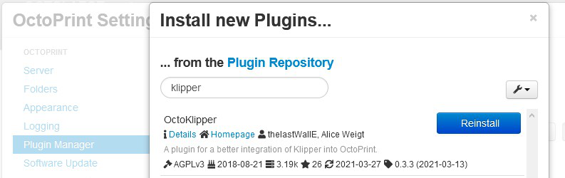

## Fork information:
- This is forked from [the original](https://github.com/mmone/OctoprintKlipperPlugin) version 0.2.5
- The fork now supports Python3 (hopefully without any new bugs)
- The current version is 0.3.5 and includes the pull requests left on the old plugin page that fixes several bugs and Themify support.

## Fork Installation Information:
- Uninstall any other versions of the plugin using Plugin Manager or other means, as necessary.
- Install this version by using Plugin Manager's "From Url" option and entering this URL:
`https://github.com/thelastWallE/OctoprintKlipperPlugin/archive/master.zip`

# OctoKlipper Plugin
This plugin assists in managing and monitoring the [Klipper](https://github.com/KevinOConnor/klipper) 3D printer firmware.

## Features
- Simplified connection dialog.
- Restart Host and MCU processes.
- User defineable macro buttons with optional parameter dialogs.
- Assisted bed leveling wizard with user definable probe points.
- PID Tuning Dialog.
- Dialog to set a coordinate offset for future GCODE move commands.
- Message log displaying messages from Klipper prepended with "//" and "!!".
- Basic Klipper configuration editor
- Performance graph displaying key parameters extracted from the Klipper logs.

## Installation

Search for "Klipper" in OctoPrints Plugin Manager.

or install manually using this URL / zip:

    https://github.com/thelastWallE/OctoprintKlipperPlugin/archive/master.zip

## Update

OctoPrint will inform you when a new version of this plugin becomes available.

## Configuration

Click on the wrench icon in the titlebar to open OctoPrints settings dialog. Select "OctoKlipper" at the bottom of the settings dialog.

## Contributions

Also for the moment this plugin does what I wanted it to do, it is far from finished, pull requests are welcome. If you want to get started, the OctoPrint Plugin API is quite well documented here: [docs.octoprint.org/en/master/plugins](http://docs.octoprint.org/en/master/plugins).

 The [devel](https://github.com/thelastWallE/OctoprintKlipperPlugin/tree/devel) branch is the branch to merge new features and bugfixes to.
 The [rc](https://github.com/thelastWallE/OctoprintKlipperPlugin/tree/rc) branch is for Release Candidates and bugfixing them.
 The [master](https://github.com/thelastWallE/OctoprintKlipperPlugin/tree/master) branch is for Stable Releases.

## Screenshots

#### Message Log

#### Bed Leveling

#### PID Tuning

#### Coordinate Offset

#### Settings

#### Klipper Config

#### Performance Graph

